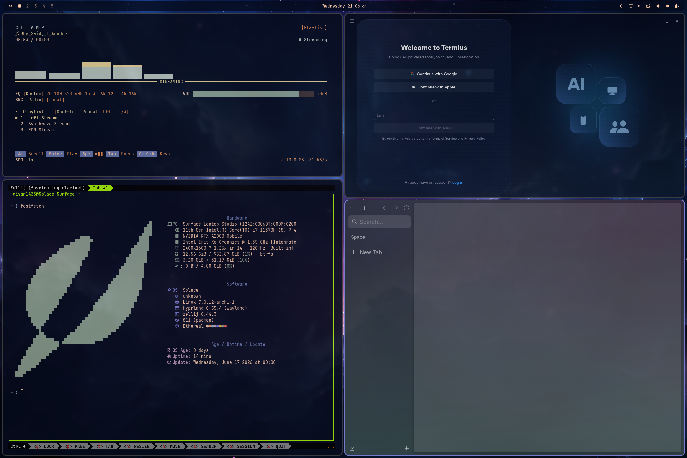
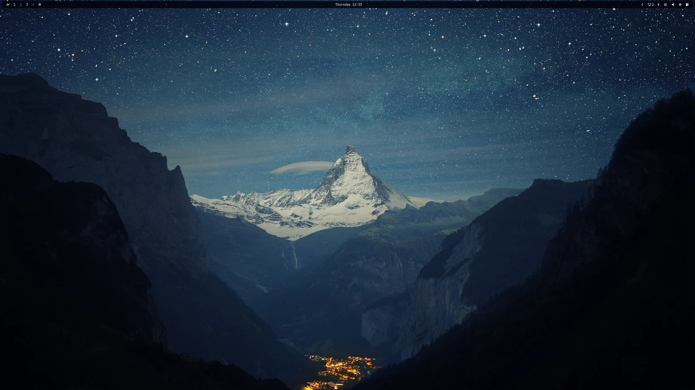
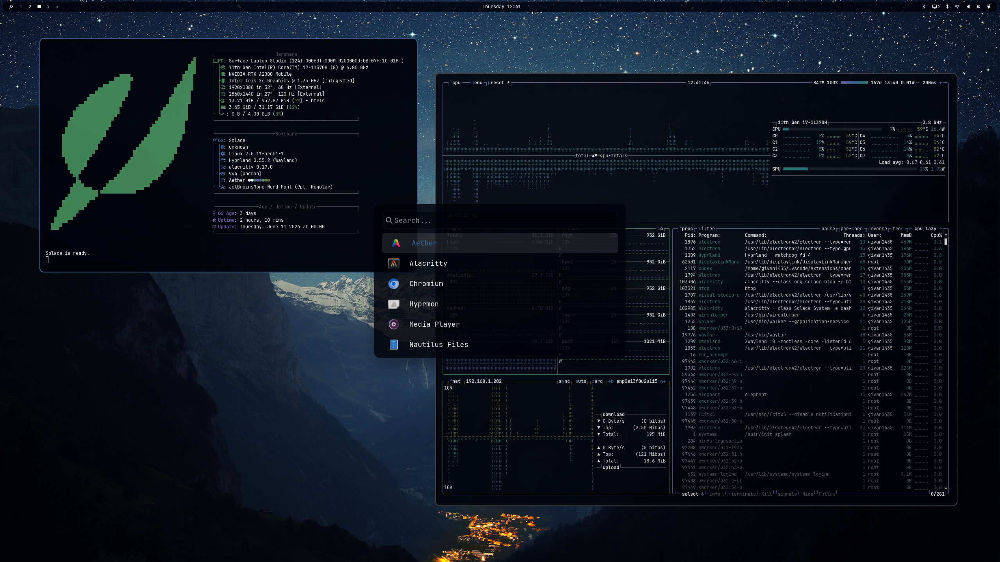
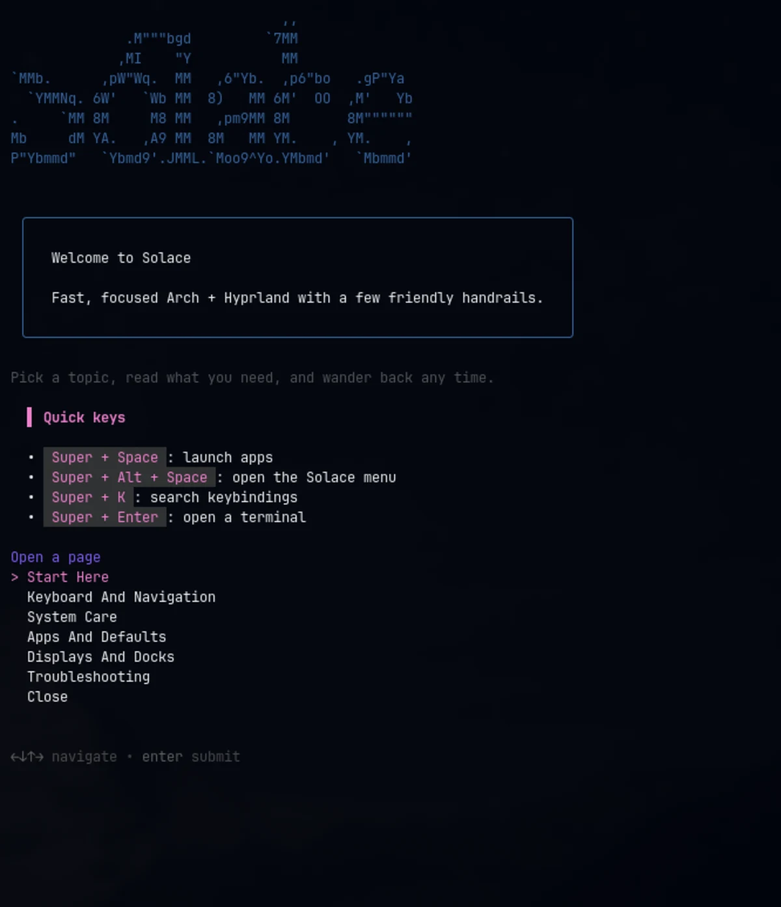

# Solace

Solace is a personal Arch Linux + Hyprland bootstrap/configuration repo.

The project tracks the parts of my preferred clean Hyprland workflow without tying the setup to a specific distro overlay or third-party mirrors. Solace configures a normal upstream Arch install into a Hyprland workstation environment.

For ISO testing and alpha release installs, read the [Solace Alpha Install Guide](docs/ALPHA_INSTALL.md).

## Screenshots









## Goals

- Use upstream Arch repositories only: `core`, `extra`, and optionally `multilib`
- Avoid depending on third-party mirrors or overlay repos
- Keep machine-specific configuration separated from general configuration
- Make setup scripts safe, readable, and repeatable

## Repository Layout

```text
Solace/
├── config/
│   ├── hypr/
│   ├── waybar/
│   ├── launcher/
│   ├── terminal/
│   ├── notifications/
│   ├── shell/
│   └── themes/
├── machine/
│   └── thinkpad/
│       └── hardware-specific configs, monitor configs, dock/display profiles
├── packages/
│   ├── pacman.txt
│   └── aur.txt
├── install/
│   ├── install.sh
│   ├── lib.sh
│   ├── 10-packages.sh
│   ├── 20-configs.sh
│   ├── 30-services.sh
│   ├── 35-login.sh
│   └── 40-postinstall.sh
└── README.md
```

## Install Flow

This repo is a post-install bootstrap for an already-installed Arch Linux system.

1. `install/install.sh` asks whether optional drawing tablet support should be installed.
2. `install/10-packages.sh` installs official repo packages from `packages/pacman.txt`, bootstraps `yay` if needed, installs AUR packages from `packages/aur.txt`, and includes optional tablet package lists when selected.
3. `install/20-configs.sh` backs up existing config and links or copies reviewed reusable config into the current user account.
4. `install/30-services.sh` enables only safe, generic services.
5. `install/31-displaylink.sh` enables DisplayLink support when `evdi-dkms` and `displaylink` are installed.
6. `install/35-login.sh` provisions SDDM, the Solace Wayland session, and login keyring behavior using the Omarchy-derived flow.
7. `install/36-boot-visuals.sh` installs the Solace Plymouth theme and applies Limine theming when Limine is present.
8. `install/40-postinstall.sh` performs light finishing steps and prints follow-up guidance.

### Usage

Dry run:

```bash
./install.sh --dry-run
```

Run everything:

```bash
./install.sh
```

Run with optional drawing tablet support preselected:

```bash
./install.sh --tablet
```

Run just packages or configs:

```bash
./install.sh --only packages
./install.sh --only configs
./install.sh --only login
```

Backups of overwritten files are stored under `~/.config-backups/solace-TIMESTAMP/`.

Notes:
- The installer now uses a root wrapper `./install.sh` which ensures the inner `install/` scripts are executable before running.
- Boot visuals are configured only after the base Arch install is already bootable; the installer does not partition disks or install a bootloader from scratch.
- The `Thinkpad/` snapshot is the source-of-truth capture for the desired desktop experience, but hardware-specific, pacman/mirror, bootloader, and machine recovery pieces must be filtered before they are installed automatically.
- This project borrows ideas from other popular Hyprland environments; it is not tied to any single distribution overlay.
